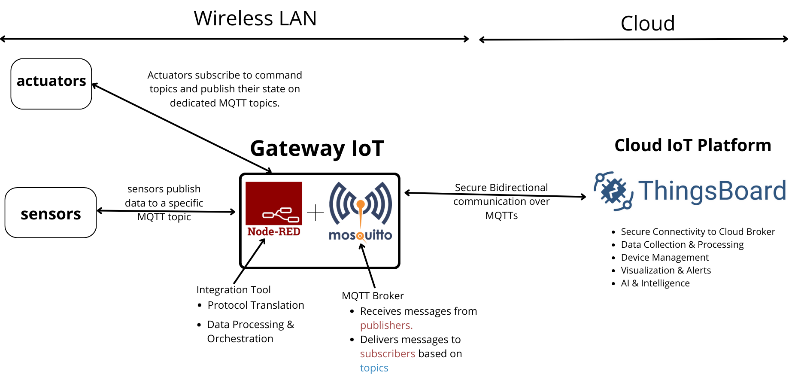

# IoT Simulation Platform with Docker

## 🏗️ Architecture Overview

This project implements a comprehensive IoT simulation platform running entirely on localhost using Docker containers. The architecture simulates a real-world IoT deployment with edge devices, local networking, and cloud connectivity capabilities.

### System Components



#### Architecture Layers

**Wireless LAN (Local Network)**
- Contains edge devices (sensors and actuators) communicating with the gateway
- Simulates a factory or building's local IoT infrastructure
- All communication within Docker network

**Gateway IoT Layer**
- **Node-RED**: Integration tool providing protocol translation, data processing, and orchestration
- **Mosquitto**: MQTT Broker receiving messages from publishers and delivering to subscribers based on topics
- Both components work together to manage local device communication

**Cloud Layer**
- **ThingsBoard**: Cloud IoT Platform providing:
  - Secure connectivity via MQTTs (MQTT over TLS)
  - Data collection and processing
  - Device management
  - Visualization and alerts
  - AI & Intelligence capabilities

#### Communication Flow

**Sensors → Gateway:**
- Sensors publish data to specific MQTT topics on Mosquitto broker
- Node-RED subscribes to these topics for processing and visualization

**Actuators ← Gateway:**
- Actuators subscribe to command topics on Mosquitto
- Node-RED can publish commands to control actuators
- Actuators publish their state back to dedicated state topics

**Gateway ↔ Cloud:**
- Secure bidirectional communication over MQTTs
- Node-RED acts as the bridge between local broker and ThingsBoard
- Enables remote monitoring and control from cloud platform


### Role Descriptions

#### 1. **IoT Simulator (Edge Devices)**
Simulates real IoT devices including:
- **Sensors**: Temperature, Humidity, Motion sensors publishing data periodically
- **Actuators**: Fan, Lamp, Alarm responding to commands

**Why in Local Network?** Simulates edge devices that typically exist in a factory or building's local network, communicating with the local gateway before reaching the cloud.

#### 2. **Mosquitto MQTT Broker (Edge Gateway)**
- Acts as the **local message broker** for device-to-device and device-to-gateway communication
- Handles MQTT pub/sub messaging protocol
- Can be configured with security features (authentication, TLS/SSL)
- Serves as the central communication hub in the local network

**Role**: Message routing, protocol translation, and local data aggregation before cloud transmission.

#### 3. **Node-RED (Local Dashboard & Bridge)**
Dual functionality:
- **Local Dashboard**: Provides real-time visualization at `http://localhost:1880/ui`
- **Cloud Bridge**: Routes selected data from local Mosquitto broker to cloud broker (ThingsBoard)
- **Data Processing**: Filters, transforms, and aggregates data before cloud transmission
- **Bidirectional Control**: Enables cloud commands to reach local devices

**Why Node-RED?** 
- Low-code visual programming for IoT flows
- Built-in MQTT support for both local and cloud brokers
- Dashboard UI for monitoring and control
- Can implement MQTT-to-MQTTS (secure) bridging for cloud communication

---

## 📁 Project Structure

```
iot-project/
├── architecture/                   # Architecture diagrams
│   └── system_diagram.png         # Visual representation of the system
│
├── mosquitto/                      # Mosquitto MQTT broker config
│   ├── dockerfile                 # Dockerfile for Mosquitto
│   ├── mosquitto.conf             # Broker configuration
│   └── mosquitto.conf.example     # Example configuration with security
│
├── nodered_data/                   # Node-RED persistent data
│   ├── flows.json                 # Node-RED flows (auto-generated)
│   ├── flows_cred.json            # Encrypted credentials
│   ├── settings.js                # Node-RED settings
│   ├── package.json               # Node dependencies
│   └── config/                    # SSH keys and certificates
│       └── (place public keys here for ThingsBoard)
│
├── simulator/                      # IoT device simulator
│   ├── Sensors/                   # Sensor scripts
│   │   ├── temperature.py
│   │   ├── humidity.py
│   │   └── motion.py
│   │
│   ├── Actuators/                 # Actuator scripts
│   │   ├── fan.py
│   │   ├── lamp.py
│   │   └── alarm.py
│   │
│   ├── .env                       # Environment variables (MQTT config)
│   ├── Dockerfile                 # Simulator container image
│   ├── requirements.txt           # Python dependencies
│   └── start.sh                   # Startup script for all devices
│
├── dashboards/                     # Dashboard configurations
│   ├── Nodered.json               # Local Node-RED dashboard
│   └── cloud_dashboard.json       # ThingsBoard cloud dashboard
│
├── docker-compose.yml             # Multi-container orchestration
└── README.md                      # This file
```

---

## 🚀 Getting Started

### Prerequisites
- Docker Desktop installed
- Docker Compose
- Basic understanding of MQTT protocol

### Step 1: Build the Mosquitto Broker Image

```powershell
cd mosquitto
docker build -t mosquitto_dt:v1 .
cd ..
```

**Note**: You can modify `mosquitto.conf` to enable security features:
- Authentication (username/password)
- TLS/SSL encryption
- Access Control Lists (ACL)

Example security configuration:
```conf
# mosquitto.conf
listener 1883
allow_anonymous false
password_file /mosquitto/config/passwd
```

### Step 2: Build the IoT Simulator Image

```powershell
cd simulator
docker build -t iot-sim .
cd ..
```

### Step 3: Start All Services

```powershell
docker compose up -d
```

This command starts:
- **Mosquitto** on ports 1883 (MQTT) and 9001 (WebSocket)
- **Node-RED** on port 1880
- **Simulator** with all sensors and actuators

Verify containers are running:
```powershell
docker ps
```

### Step 4: Configure Node-RED

#### 4.1 Install Dashboard Dependencies

1. Access Node-RED at `http://localhost:1880`
2. Go to **Menu (☰) → Manage palette → Install**
3. Search and install:
   - `node-red-dashboard`
   - `node-red-contrib-thingsboard` (for cloud integration)

#### 4.2 Import Local Dashboard

1. In Node-RED, click **Menu (☰) → Import**
2. Select the `dashboards/Nodered.json` file
3. Click **Import**
4. Click **Deploy** (top right)

#### 4.3 Access the Dashboard

Navigate to: `http://localhost:1880/ui`

You should see real-time sensor data and actuator controls.

---

## ☁️ Cloud Integration (ThingsBoard)

### Step 1: Set Up ThingsBoard Account

1. Create account at [ThingsBoard Cloud](https://thingsboard.cloud) or deploy your own instance
2. Create a new device in ThingsBoard
3. Copy the **device access token**

### Step 2: Configure Node-RED for Cloud Connection

#### 2.1 Download and Import ThingsBoard Public Key (if using MQTTS)

1. Download the ThingsBoard public key from their official documentation or website.

2. Import the **public key** into the Node-RED config volume:
```powershell
copy thingsboard_public_key.pem nodered_data/
```

3. Configure Node-RED to use this public key for secure communication with ThingsBoard.

#### 2.2 Import Cloud Dashboard

1. In Node-RED, import `dashboards/cloud_dashboard.json`
2. Configure the MQTT broker node with ThingsBoard credentials:
   - **Broker**: `mqtt.thingsboard.cloud` (or your instance)
   - **Port**: 1883 (MQTT) or 8883 (MQTTS)
   - **Username**: Your device access token
   - **Enable TLS**: Check if using MQTTS

3. Deploy the flows

### Step 3: Import ThingsBoard Dashboard

1. Log in to ThingsBoard
2. Go to **Dashboards → Import**
3. Upload `dashboards/cloud_dashboard.json`
4. Verify data is flowing from your local Node-RED to ThingsBoard

---

## 🔄 Bidirectional Communication Flow

### Local to Cloud (Data Publish)
```
Sensors → Local Mosquitto → Node-RED → Cloud Broker (ThingsBoard)
```

### Cloud to Local (Command Control)
```
ThingsBoard Dashboard → Cloud Broker → Node-RED → Local Mosquitto → Actuators
```

Node-RED acts as the **bridge**, subscribing to local topics and republishing to cloud topics, and vice versa.

---

## 📊 MQTT Topics

### Sensor Topics (Publish)
- `home/sensor/temperature`
- `home/sensor/humidity`
- `home/sensor/motion`

### Actuator Topics

#### Command (Subscribe)
- `home/fan/command`
- `home/lamp/command`
- `home/alarm/command`

#### State (Publish)
- `home/fan/state`
- `home/lamp/state`
- `home/alarm/state`

### Example Commands

**Turn Fan ON:**
```json
{
  "command": "ON"
}
```


## 🔒 Security Enhancements

### Enable Mosquitto Authentication

1. Create password file:
```powershell
docker exec mosquitto_container_iot mosquitto_passwd -c /mosquitto/config/passwd admin
```

2. Update `mosquitto.conf`:
```conf
allow_anonymous false
password_file /mosquitto/config/passwd
```

3. Restart Mosquitto:
```powershell
docker compose restart mosquitto
```

### Enable TLS/SSL

1. Generate certificates (or use Let's Encrypt)
2. Mount certificates in `docker-compose.yml`
3. Update `mosquitto.conf` with certificate paths
4. Configure Node-RED MQTT nodes to use TLS

---

## 📈 Monitoring & Visualization

### Local Dashboard
- **URL**: `http://localhost:1880/ui`
- **Features**: Real-time sensor graphs, actuator controls, system status

### Cloud Dashboard (ThingsBoard)
- **URL**: `https://thingsboard.cloud` (or your instance)
- **Features**: Historical data, alarms, advanced analytics, mobile access

---


## 📚 Additional Resources

- [MQTT Protocol Documentation](https://mqtt.org/)
- [Node-RED Documentation](https://nodered.org/docs/)
- [Mosquitto Documentation](https://mosquitto.org/documentation/)
- [ThingsBoard Documentation](https://thingsboard.io/docs/)

---

## 📝 License

This project is for educational and simulation purposes.

---

## 👥 Contributing

Feel free to submit issues, fork the repository, and create pull requests for any improvements.

---

**Happy IoT Simulating! 🚀**
